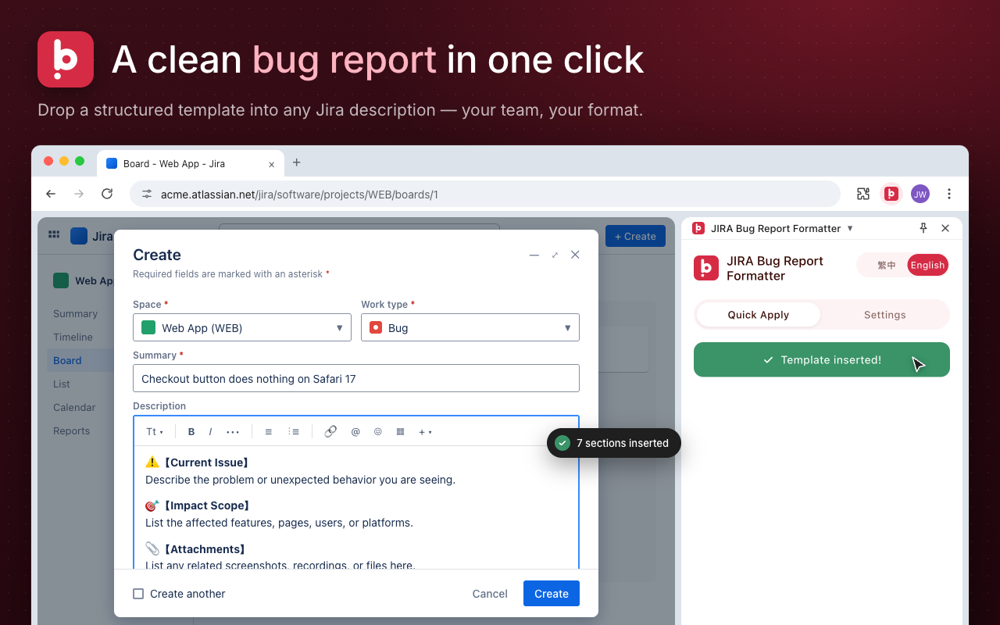

# JIRA Bug Report Formatter

Effortlessly produce structured JIRA bug reports with a single click. This Chrome extension injects a customizable HTML template directly into the ticket description so teams can capture consistent details without repetitive copy-and-paste work.

Relevant Link 😊: [Bug-Report-Formatter](https://chromewebstore.google.com/detail/jira-bug-report-formatter/mjfnjjkioaaebpdfhfdedlbbhnoinnec?authuser=0&hl=en&pli=1)

> Looking for the Traditional Chinese guide? See [README.zh-TW.md](README.zh-TW.md).



## Features

- **One-click template injection** – Populate the JIRA description field with a structured bug report template right from the side panel.
- **Focused default template** – Seven sections: Current Issue, Impact Scope, Attachments, Reproduction Steps, Expected Result, Test Environment, Additional Information.
- **Fully customizable content** – Edit the HTML template in Settings; one click on **Restore default** brings back the built-in version.
- **Domain whitelisting / blacklisting** – Control exactly which JIRA domains the extension works on and which URLs are ignored.
- **Bilingual UI** – Switch between Traditional Chinese and English; each language keeps its own template.
- **Minimal permissions** – Uses only `storage`, `sidePanel`, and `scripting`; all data stays in the browser.

## Installation

**From the Chrome Web Store (recommended):** install via the [store listing](https://chromewebstore.google.com/detail/jira-bug-report-formatter/mjfnjjkioaaebpdfhfdedlbbhnoinnec).

**From source:**

1. Clone this repository:
   ```bash
   git clone https://github.com/JulianWangHZ/JIRA-BugReport-Formatter.git
   ```
   Or download the zip from the latest [GitHub Release](https://github.com/JulianWangHZ/JIRA-BugReport-Formatter/releases/latest) and unzip it.
2. Open `chrome://extensions/` in Chrome.
3. Enable **Developer mode** in the top-right corner.
4. Click **Load unpacked** and select the project (or unzipped) folder.
5. The “JIRA Bug Report Formatter” icon will appear in your toolbar.

## Usage

1. Navigate to any JIRA ticket creation or edit page.
2. Open the extension side panel from the Chrome toolbar.
3. In the **Quick Apply** tab, click **Apply Bug Report Template**.
4. The description field is filled with the template; fill in the details and create the ticket.

## Configuration

Switch to the **Settings** tab in the side panel:

- **JIRA Domains** – Domains where the extension is active (one per line). Defaults: `*.atlassian.net`, `*.jira.com`, `*/jira/*`.
- **Blocked Domains** – Pages that should never receive the template, e.g. `*/wiki/*` for Confluence.
- **Description Template** – Edit the HTML directly and click **Save Settings**. Click **Restore default** to reset the current language's template instantly.

All settings are stored in Chrome Sync Storage, so they follow you across devices signed into the same account.

## Troubleshooting

- **“⚠️ Cannot run on chrome:// pages”** – Chrome blocks extensions on internal pages. Switch to a regular JIRA tab and try again.
- **Template does not appear** – Make sure the description field is empty, the URL is not blocked, and the page has finished loading.
- **Still seeing an old template after an update** – A previously saved template takes priority over the new default. Open **Settings** and click **Restore default**.

## Development

- Core files:
  - `sidepanel.html` / `sidepanel.css` / `sidepanel.js` – Side panel UI and logic
  - `content.js` – Template injection inside the JIRA page
  - `constants.js` – Default domains, templates, and UI strings
  - `icons/` – Logo (`logo.svg`) and toolbar icons
- After making changes, reload the extension from `chrome://extensions/`.

### Releases

Releases are automated with GitHub Actions:

- **Pull requests** (`.github/workflows/pr-check.yml`) – validate `manifest.json`, syntax-check scripts, and preview the next version in the job summary.
- **Merge to `main`** (`.github/workflows/release.yml`) – bump `manifest.json`, tag `vX.Y.Z`, and publish a GitHub Release with the packaged zip.

The version bump follows [Conventional Commits](https://www.conventionalcommits.org/) since the last tag:

| Commit / PR title | Bump |
|---|---|
| `feat!: ...` or `BREAKING CHANGE:` | major |
| `feat: ...` | minor |
| anything else (`fix:`, `refactor:`, ...) | patch |

Changes that only touch docs, `store-assets/`, or `.github/` don't trigger a release. Uploading to the Chrome Web Store is still manual — use the zip attached to the release.

## License

Released under the MIT License. See [`LICENSE`](LICENSE) for details.
